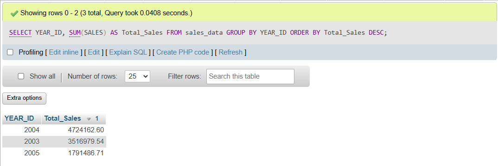
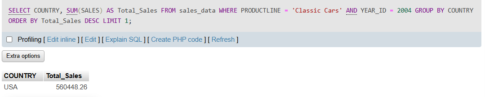
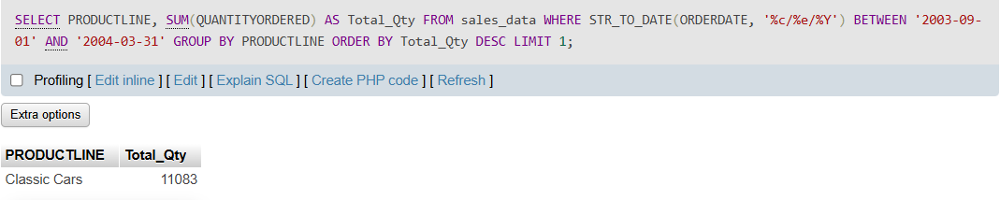

# Retail Sales Analysis: SQL Case Study

## Project Overview:
This project was completed as part of a data analytics mini course. Acting as a data analyst for a global retail company, I processed raw transaction dataset into a MySQL database to extract business insights to improve operational efficiency and customer satisfaction.

## Tech Stack & Environment
* **Database Engine:** MySQL (via XAMPP)
* **Language:** SQL
* **Source Data:** The dataset used is provided by **RevoU** as part of the **Data Analytics Mini Course (6 March 2026)**. The dataset consist of mocked transaction data strictly used for educational purposes and portfolio demonstration only. 

## Case Study
### 1. Total Sales by Year

### 2. Country with the highest Classi Cars sales (2004)

### 3. Most sold product line (by quantity) from Sep 2003 to Mar 2004

## Key Technical Takeaways
* **Data Type Management:** Handled non-standard date text strings (`2/24/2003 12:00:00 AM`) by applying the `STR_TO_DATE()` function in MySQL to allow accurate chronological filtering.
* **Aggregations:** Utilized `SUM()`, `GROUP BY`, and `ORDER BY` operators to distill thousands of rows of raw transactional logs into high-level business metrics.
